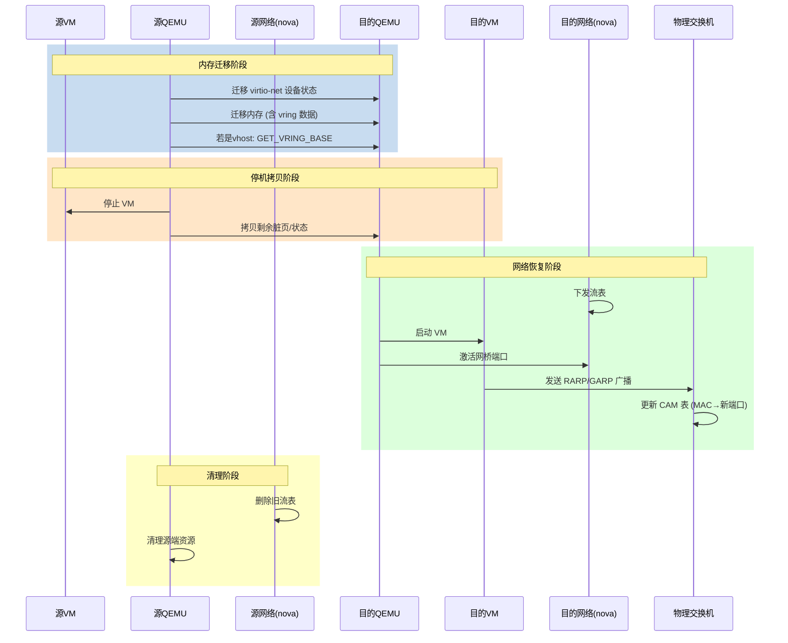

# KVM 热迁移机制

KVM 热迁移允许虚拟机在不停机的情况下从源主机迁移到目的主机。

## 热迁移命令

```bash
# 整机迁移（含磁盘）
virsh migrate --live --p2p --unsafe \
    --migrateuri tcp://9.31.3.238 \
    instance-00005c53 \
    qemu+tcp://9.31.3.238/system \
    --verbose --copy-storage-all

# 内存迁移（不含磁盘）
virsh migrate --live --p2p --unsafe \
    instance-00005c53 \
    qemu+tcp://9.31.3.238/system
```

| 参数 | 说明 |
|------|------|
| --live | 热迁移 |
| --p2p | 点对点迁移 |
| --copy-storage-all | 整机迁移（含磁盘） |
| --unsafe | 跳过安全检查 |

## 迁移流程

### 主要阶段
```
qemuMigrationSrcPerformPeer2Peer3
├── qemuMigrationSrcBeginPhase → 解析XML
├── domainMigratePrepare3 → 目的端创建domain
├── qemuMigrationSrcPerformNative → 数据迁移
├── domainMigrateFinish3 → 目的端完成
└── qemuMigrationSrcConfirmPhase → 清理
```

### 内存拷贝三阶段

| 阶段 | 说明 | 周期 |
|------|------|------|
| 数据迁移 | 脏页同步，限速拷贝 | ~1s |
| 快速迭代 | 高频同步，CPU降频 | ~50ms |
| 停机拷贝 | 源端停机，拷贝剩余脏页 | 立即 |

### 停机条件
```
M < threshold_size
threshold_size = bandwidth * downtime_limit
```

## 迁移要点

| 注意点 | 说明 |
|--------|------|
| 大页打散 | 迁移前按4K粒度打散（耗时） |
| getdirty性能 | 陷出标脏影响虚拟机性能 |
| CPU降频 | 脏页速率>带宽时降频 |
| 强制收敛 | 满足条件后激活强制收敛 |
| RARP广播 | 迁移结束目的端异步广播 |

## 迁移耗时组成

```
总耗时 = FS调度下发 + 内存迭代拷贝 + 网络流表下发 + 页表重建
```

## 内存迁移流程

```
阶段一: 数据迁移
├── 1s周期脏页同步
├── 限速带宽拷贝
├── 脏页速率>带宽20次 → 失败
└── M < threshold_size → 进入阶段二

阶段二: 快速迭代
├── 50ms周期脏页同步
├── CPU降频（每2/4次降一档）
├── 强制收敛激活
└── M < bandwidth*min_downtime → 进入阶段三

阶段三: 停机拷贝
├── 源端虚拟机停机
├── 最大带宽拷贝剩余脏页
└── 目的端启动
```

## 网络迁移时序图



## 迁移详细流程

```
qemuMigrationSrcPerformPeer2Peer3
├── qemuMigrationSrcBeginPhase → 解析传入虚拟机XML
├── domainMigratePrepare3 → 远程创建目的端domain
├── qemuMigrationSrcPerformNative → 开始数据迁移动作
├── domainMigrateFinish3 → 等待目的端完成
└── qemuMigrationSrcConfirmPhase → 清理源端or目的端
```

### incoming 接收端

目的端启动 qemu 监听 incoming，接收数据传输完成后修改状态位。

## 相关链接

- [[concepts/kvm-virtualization]]
- [[summaries/virtio-architecture]]